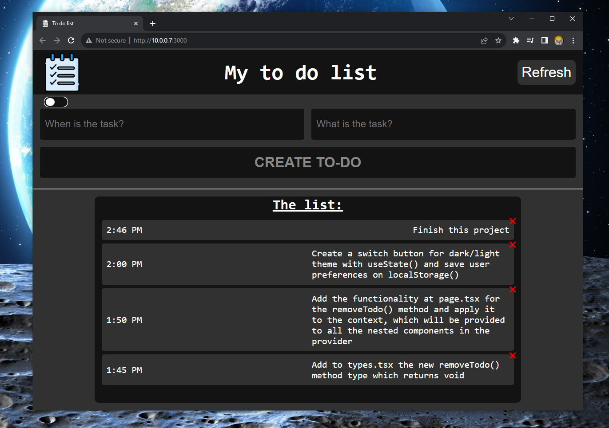
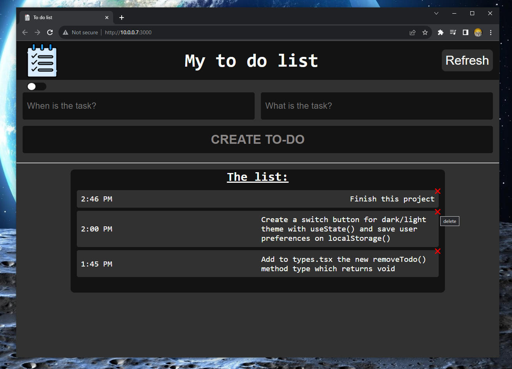
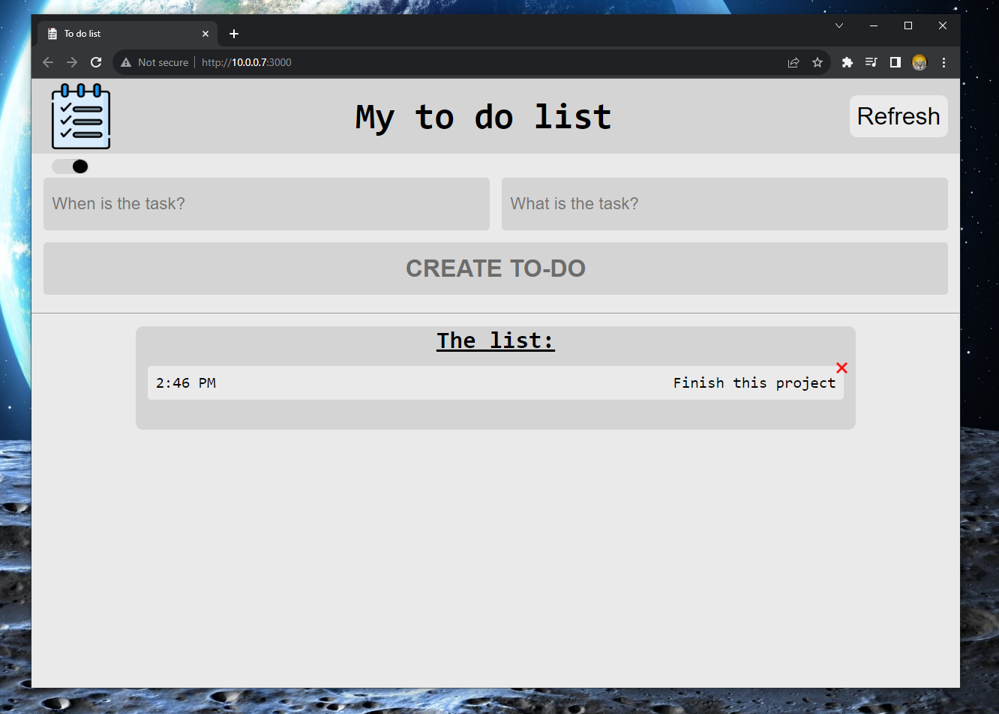
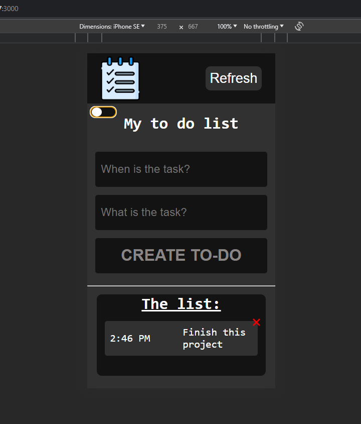

## TO-DO-LIST_APP
A responsive Next.JS app which allows people to save their "to-do" tasks in localStorage, with the ability to remove some of them by clicking the "x", refresh everything and change theme.
Some photos of the website:

You can delete "to-do"s:

Light Theme:

It is Responsive:

The web kit I used for this project was: Next.JS, React, TypeScript and CSS.
The main goal of this project is to practice my React skills with TypeScript
